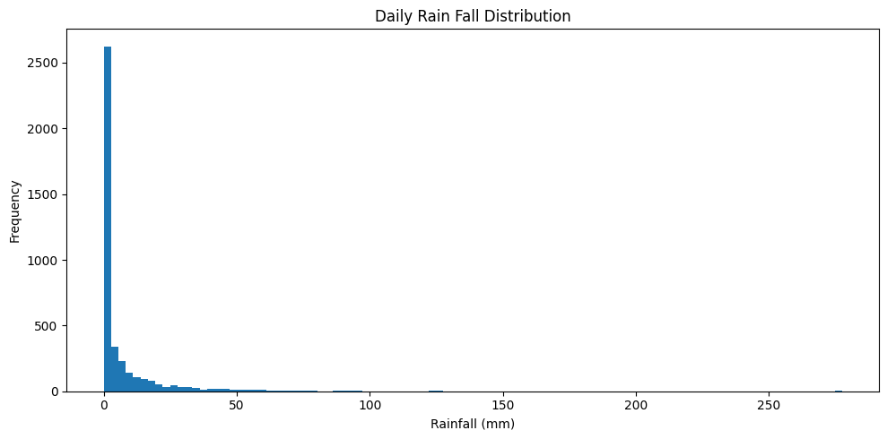

# Weather Prediction Using Two Stage Model (Random Forest Classifier + XGBRegressor) In DKI Jakarta 2025

Indonesia adalah negara beriklim tropis yang memiliki dua musim utama, yaitu musim kemarau dan musim penghujan. Fluktuasi curah hujan, terutama di musim penghujan, seringkali sulit diprediksi. Oleh karena itu, penelitian ini bertujuan untuk membangun model prediksi yang dapat memprakirakan terjadinya hujan pada hari berikutnya (besok) berdasarkan data historis meteorologi yang diperoleh dari bank data BMKG.

---

## Table of Contents
1. [Dataset](#dataset)
2. [Flowchart](#flowchart)
3. [Data Understanding](#data-understanding)
4. [Data Preprocessing](#data-preprocessing)
5. [Feature Engineering](#feature-engineering)
6. [Model Development](#model-development)
7. [Results](#results)
8. [Conclusion](#conclusion)
9. [License](#license)
10. [Contact](#contact)

---

## Dataset 
Dataset yang digunakan dalam penelitian ini adalah data meteorologi historis harian yang bersumber dari portal data online resmi Badan Meteorologi, Klimatologi, dan Geofisika (BMKG) Indonesia dengan pemilihan lokasi di Jakarta Pusat. 
- Sumber: dataonline.bmkg.go.id
- Rentang Waktu: Data diambil untuk periode 1 Januari 2015 hingga 07 Desember 2025.
- Volume Data: Dataset ini terdiri dari 4019 baris data (observasi), di mana setiap baris merepresentasikan data cuaca harian.

Dataset ini memiliki 11 atribut orisinal yang mencatat berbagai parameter cuaca dengan keterangan sebagai berikut  :

| Nama Kolom | Keterangan | Satuan |
| :--- | :--- | :--- |
| `tanggal` | Waktu pencatatan data | - |
| `TN` | Temperatur Minimum | °C |
| `TX` | Temperatur Maksimum | °C |
| `TAVG` | Temperatur Rata-rata | °C |
| `RH_AVG` | Kelembapan Rata-rata | % |
| `RR` | Curah Hujan | mm |
| `SS` | Lamanya Penyinaran Matahari | jam |
| `FF_X` | Kecepatan Angin Maksimum | m/s |
| `DDD_X` | Arah Angin saat Kecepatan Maks. | ° (derajat) |
| `FF_AVG` | Kecepatan Angin Rata-rata | m/s |
| `DDD_CAR` | Arah Angin Terbanyak | ° (derajat) |

[↑ Back to Top](#Table of Contents)

---

## Flowchart

[↑ Back to Top](#Table of Contents)
---

## Data Understanding

### Rainfall Distribution Analysis

Dari graphic ini menunjukkan dominasi nilai 0 mm, yang mengindikasikan bahwa sebagian besar hari tidak mengalami hujan. Sementara itu, nilai curah hujan non-nol memiliki distribusi yang sangat skewed ke arah kanan, dengan ekor panjang (heavy-tailed) yang merepresentasikan kejadian hujan kategori sedang hingga ekstrem.

Disini terlihat keberadaan outlier ekstrem yang jumlahnya relatif sedikit tetapi bernilai jauh lebih besar dibandingkan mayoritas data. Hal ini menegaskan bahwa data curah hujan bersifat zero-inflated dan heavy-tailed. 

### Correlation Analysis

Berdasarkan heatmap korelasi Spearman pada data meteorologi mentah, terlihat bahwa hubungan antara curah hujan dan variabel cuaca lain pada hari yang sama umumnya berada pada tingkat lemah hingga moderat. Curah hujan menunjukkan korelasi positif moderat dengan kelembapan rata-rata, serta korelasi negatif dengan temperatur dan lamanya penyinaran matahari, yang sejalan dengan karakteristik fisik proses hujan. Namun, tidak ditemukan korelasi yang sangat kuat dengan satu variabel pun, mengindikasikan bahwa hubungan langsung (simultan) antar variabel belum cukup menjelaskan variabilitas curah hujan secara menyeluruh.

### Baseline Models

Baseline Classification 
| Class | Precision | Recall | F1-Score | Support |
| :--- | :---: | :---: | :---: | :---: |
| **Tidak Hujan** | 0.66 | 0.56 | 0.61 | 373 |
| **Hujan** | 0.66 | 0.75 | 0.71 | 431 |
| | | | | |
| **Accuracy** | | | **0.66** | **804** |
| **Macro Avg** | 0.66 | 0.66 | 0.66 | 804 |
| **Weighted Avg** | 0.66 | 0.66 | 0.66 | 804 |

Baseline Regression Result 

MAE:  10.681 mm
RMSE: 20.818 mm

### Key Findings from Data Understanding
- Berdasarkan analisis distribusi data, curah hujan harian menunjukkan karakteristik zero-inflated, di mana sebagian besar observasi bernilai nol, serta distribusi heavy-tailed pada hari-hari dengan hujan. Hal ini mengindikasikan adanya perbedaan proses antara pembentukan kejadian hujan (occurrence) dan mekanisme yang menentukan besaran curah hujan (intensity).

- Selanjutnya, analisis korelasi Spearman pada data mentah menunjukkan bahwa hubungan simultan antara curah hujan dan variabel meteorologi lainnya cenderung lemah hingga moderat. Hal ini mengindikasikan bahwa informasi yang terkandung dalam data mentah pada hari yang sama belum cukup merepresentasikan dinamika curah hujan secara komprehensif, sehingga diperlukan feature engineering berbasis temporal untuk menangkap pola historis dan ketergantungan waktu.

- Berdasarkan karakteristik distribusi yang bersifat zero-inflated serta keterbatasan informasi pada fitur meteorologi mentah, pemodelan curah hujan memerlukan pendekatan yang mampu menangani kejadian hujan dan intensitas hujan secara terpisah, sekaligus memanfaatkan informasi temporal. Oleh karena itu, pendekatan two-stage modeling dipilih, dengan memisahkan prediksi kejadian hujan (classification) dan besaran curah hujan (regression), sehingga diharapkan menghasilkan prediksi yang lebih stabil, robust terhadap dominasi nilai nol, dan lebih representatif dibandingkan pendekatan satu tahap.

[↑ Back to Top](#Table of Contents)
---

## Data Preprocessing 
- Menyatukan Data Historis Menjadi 1 File
- Cek Missing Values
- Melakukan Data Mapping 
- Mengisi missing values menggunakan Random Forest 
- Melakukan Feature Engineering

[↑ Back to Top](#Table of Contents)
---

## Feature Engineering
1. Mengurutkan Data Berdasarkan Tanggal 

    Data diurutkan secara kronologis berdasarkan kolom Tanggal untuk memastikan struktur time series terjaga dan mencegah data leakage pada proses pemodelan.

2. Membuat Lag Features
    Lag features dibuat untuk variabel Curah Hujan (mm) serta variabel cuaca yang memiliki korelasi tinggi terhadapnya, yaitu:

    * Kelembapan Rata-rata
    * Temperatur Rata-rata
    * Temperatur Maksimum
    * Temperatur Minimum
    * Lamanya Penyinaran Matahari

    Dengan lag yang digunakan yakni dari 1 hingga 4 hari sebelumnya 

3. Membuat Rolling Mean (Moving Average)

    Rolling mean dilakukan untuk variabel-variabel yang berkorelasi tinggi dengan curah hujan menggunakan gap waktu 3 dan 7 hari. Setelah itu rolling mean di-shift satu hari ke belakang agar hanya memanfaatkan informasi historis dan tidak terjadi leakage.

4. Membuat Exponentially Weighted Moving Average (EWMA)

    EWMA dibuat khusus untuk variabel Curah Hujan (mm) dengan periode 3 dan 7 hari. Metode ini memberikan bobot lebih besar pada observasi terbaru sehingga lebih sensitif terhadap perubahan pola curah hujan dibanding rolling mean biasa.

5. Rolling Standard Deviation

    Rolling standard deviation digunakan untuk mengukur tingkat variasi curah hujan dalam jendela waktu tertentu (7 hari).

5. Cylical Encoding 

    Cyclical encoding diterapkan pada informasi waktu untuk menangkap pola musiman curah hujan. Kolom Tanggal diturunkan menjadi fitur dayofyear, kemudian direpresentasikan menggunakan fungsi sinus dan cosinus. Pendekatan ini digunakan agar model memahami bahwa waktu bersifat siklikal.

6. Fitur Kejadian Hujan Ekstrem
    
    Fitur kejadian hujan ekstrem dibuat untuk menangkap kondisi curah hujan yang tidak biasa. Ambang hujan ekstrem ditentukan menggunakan quantile ke-90 dari distribusi curah hujan.Fitur ini bertujuan untuk membantu model mengenali pengaruh kejadian hujan ekstrem sebelumnya terhadap kejadian hujan di hari berikutnya.

[↑ Back to Top](#Table of Contents)
---

## Model Development

### Data Modelling

Adapun proses modelling yang dilakukan menggunakan pendekatan **two-stage hybrid model**: 
1. **Classification** untuk memprediksi kejadian hujan (hujan/tidak hujan).
2. **Regression** untuk memprediksi intensitas curah hujan, yang **hanya dilatih menggunakan data dengan hari-hari hujan saja**.

Pendekatan ini membantu mengurangi bias dari dominasi data nol (hari tanpa hujan) dan memungkinkan model regresi fokus mempelajari pola intensitas hujan.

### Data Splitting 
Data dibagi menjadi 80% train dan 20% test secara time-ordered (tanpa shuffle) untuk menjaga struktur temporal time series dan mencegah data leakage.

### Classification
Tahap pertama bertujuan memprediksi kejadian hujan sebagai masalah klasifikasi biner, dengan label 0 untuk tidak hujan dan 1 untuk hujan. Model yang digunakan adalah **Random Forest Classifier** dengan parameter `class_weight="balanced"` untuk menangani ketidakseimbangan kelas. Model dilatih menggunakan seluruh data training (baik hari hujan maupun tidak hujan). Model menghasilkan probabilitas hujan (0-1), yang kemudian dikonversi menjadi prediksi kelas menggunakan threshold 0.5.

### Regression

Tahap kedua memprediksi intensitas curah hujan dengan pendekatan yang berbeda. **Model regresi HANYA dilatih menggunakan data hari-hari hujan** (rain days only), yaitu sampel di mana curah hujan aktual > 0 mm. Proses filtering dilakukan sebagai berikut:

1. Filtering data: Dari seluruh dataset, hanya diambil baris-baris di mana `Rain_mm_t+1 > 0` (berdasarkan ground truth/data aktual)
2. Target transformation: Curah hujan ditransformasi menggunakan `log1p` untuk mengurangi skewness distribusi

Model yang digunakan adalah **XGBoost Regressor**. Dengan hanya melatih pada hari-hari hujan, model dapat fokus mempelajari pola intensitas hujan tanpa terganggu oleh nilai nol yang dominan, sehingga menghasilkan prediksi intensitas yang lebih akurat.

### Hybrid Prediction

Pada tahap prediksi, kedua model digabungkan secara sekuensial:
- Jika classifier memprediksi **tidak hujan** (probabilitas < 0.5) → curah hujan final = 0 mm
- Jika classifier memprediksi **hujan** (probabilitas ≥ 0.5) → regressor dipanggil untuk memprediksi intensitas, dan hasil akhir = probabilitas × prediksi intensitas

[↑ Back to Top](#Table of Contents)
---

## Results

### Impact of Temporal Feature Engineering

- Penerapan feature engineering berbasis waktu menghasilkan peningkatan performa yang konsisten dibandingkan baseline yang hanya menggunakan fitur meteorologi mentah. Pada tahap klasifikasi, akurasi meningkat dari 66% menjadi 71%, dengan nilai ROC-AUC sebesar 77%, yang menunjukkan kemampuan model yang lebih baik dalam membedakan hari hujan dan tidak hujan.

- Pada tahap regresi, pemodelan intensitas hujan menghasilkan penurunan MAE dari 10.681 mm menjadi 6.764 mm dan RMSE dari 20.818 mm menjadi 16.452 mm. Peningkatan ini mengindikasikan bahwa fitur temporal seperti lag features, rolling statistics, dan EWMA memberikan konteks historis yang relevan, sehingga model mampu menangkap dinamika hujan yang tidak terlihat pada fitur harian statis.

### Major factors contributing to rainfall

- Hasil analisis feature importance menunjukkan bahwa prediksi curah hujan didominasi oleh fitur hasil feature engineering berbasis temporal, khususnya yang merepresentasikan kondisi atmosfer lembap dan pola historis curah hujan. Fitur dengan kontribusi tertinggi adalah kelembapan rata-rata pada satu hari sebelumnya (lag-1), diikuti oleh berbagai representasi curah hujan historis seperti exponentially weighted moving average (EWMA), rolling mean, dan rolling standard deviation.

- Dominasi fitur-fitur tersebut mengindikasikan bahwa hujan tidak ditentukan oleh kondisi cuaca instan, melainkan oleh akumulasi dan persistensi kondisi atmosfer dalam beberapa hari sebelumnya. Feature engineering memungkinkan model menangkap dinamika temporal ini, yang tidak dapat direpresentasikan secara memadai oleh variabel meteorologi mentah pada hari yang sama.

### Model Limitations and Performance

Rainfall prediction remains challenging due to the complex and localized nature of rainfall events. This project relies on daily surface-level meteorological data, which limits the model’s ability to capture short-lived or highly localized rain events. Further improvements would likely require higher-resolution or additional data sources such as weather radar or satellite imagery.

[↑ Back to Top](#Table of Contents)
---

## Conclusion 

This project demonstrates that daily rainfall prediction in tropical regions is better approached using a two-stage model rather than a single regression model. By separating rainfall occurrence and intensity, and incorporating temporal feature engineering, the model is able to better capture historical weather patterns and reduce bias from zero-inflated data. While performance is constrained by the use of daily surface-level data, the proposed approach provides a more stable and interpretable framework for short-term rainfall prediction.

[↑ Back to Top](#Table of Contents)
---

## License

This project is licensed under the MIT License.

---

## Contact

If you have any questions or feedback, feel free to reach out:
- **Email:** Ayusekar1822@gmail.com
- **LinkedIn:** https://www.linkedin.com/in/ayusekar22/
- **GitHub:** https://github.com/Ayusekar22

[↑ Back to Top](#Table of Contents)