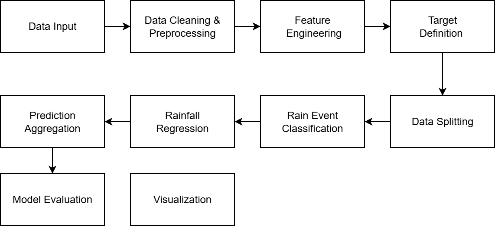

## Weather Prediction Using Two Stage Model (Random Forest Classifier + XGBRegressor) In DKI Jakarta 2025

## Description 
Indonesia adalah negara beriklim tropis yang memiliki dua musim utama, yaitu musim kemarau dan musim penghujan. Fluktuasi curah hujan, terutama di musim penghujan, seringkali sulit diprediksi. Oleh karena itu, penelitian ini bertujuan untuk membangun model prediksi yang dapat memprakirakan terjadinya hujan pada hari berikutnya (besok) berdasarkan data historis meteorologi yang diperoleh dari bank data BMKG.

## Dataset 
Dataset yang digunakan dalam penelitian ini adalah data meteorologi historis harian yang bersumber dari portal data online resmi Badan Meteorologi, Klimatologi, dan Geofisika (BMKG) Indonesia dengan pemilihan lokasi di Jakarta Pusat. 
- Sumber: dataonline.bmkg.go.id
- Rentang Waktu: Data diambil untuk periode 1 Januari 2015 hingga 07 Desember 2025.
- Volume Data: Dataset ini terdiri dari 4019 baris data (observasi), di mana setiap baris merepresentasikan data cuaca harian.

Dataset ini memiliki 11 atribut orisinal yang mencatat berbagai parameter cuaca dengan keterangan sebagai berikut  :

| Nama Kolom | Keterangan | Satuan |
| :--- | :--- | :--- |
| `tanggal` | Waktu pencatatan data | - |
| `TN` | Temperatur Minimum | °C |
| `TX` | Temperatur Maksimum | °C |
| `TAVG` | Temperatur Rata-rata | °C |
| `RH_AVG` | Kelembapan Rata-rata | % |
| `RR` | Curah Hujan | mm |
| `SS` | Lamanya Penyinaran Matahari | jam |
| `FF_X` | Kecepatan Angin Maksimum | m/s |
| `DDD_X` | Arah Angin saat Kecepatan Maks. | ° (derajat) |
| `FF_AVG` | Kecepatan Angin Rata-rata | m/s |
| `DDD_CAR` | Arah Angin Terbanyak | ° (derajat) |

## Flowchart
Dibawah ini merupakan alur dari project ini 

## Data Understanding

## Objectives 

## Data Preprocessing 
- Menyatukan Data Historis Menjadi 1 Excel
- Cek Missing Values
- Melakukan Data Mapping 
- Mengisi missing values menggunakan Random Forest 
- Melakukan Feature Engineering

## Feature Engineering
1. Mengurutkan Data Berdasarkan Tanggal 
Data diurutkan secara kronologis berdasarkan kolom Tanggal untuk memastikan struktur time series terjaga dan mencegah data leakage pada proses pemodelan.

2. Membuat Lag Features
Lag features dibuat untuk variabel Curah Hujan (mm) serta variabel cuaca yang memiliki korelasi tinggi terhadapnya, yaitu:

* Kelembapan Rata-rata
* Temperatur Rata-rata
* Temperatur Maksimum
* Temperatur Minimum
* Lamanya Penyinaran Matahari

Dengan lag yang digunakan yakni dari 1 hingga 4 hari sebelumnya 

3. Membuat Rolling Mean (Moving Average)
Rolling mean dilakukan untuk variabel-variabel yang berkorelasi tinggi dengan curah hujan menggunakan gap waktu 3 dan 7 hari. Setelah itu rolling mean di-shift satu hari ke belakang agar hanya memanfaatkan informasi historis dan tidak terjadi leakage.

4. Membuat Exponentially Weighted Moving Average (EWMA)
EWMA dibuat khusus untuk variabel Curah Hujan (mm) dengan periode 3 dan 7 hari. Metode ini memberikan bobot lebih besar pada observasi terbaru sehingga lebih sensitif terhadap perubahan pola curah hujan dibanding rolling mean biasa.

5. Rolling Standard Deviation
Rolling standard deviation digunakan untuk mengukur tingkat variasi curah hujan dalam jendela waktu tertentu (7 hari).

5. Cylical Encoding 
Cyclical encoding diterapkan pada informasi waktu untuk menangkap pola musiman curah hujan. Kolom Tanggal diturunkan menjadi fitur dayofyear, kemudian direpresentasikan menggunakan fungsi sinus dan cosinus. Pendekatan ini digunakan agar model memahami bahwa waktu bersifat siklikal.

6. Fitur Kejadian Hujan Ekstrem
Fitur kejadian hujan ekstrem dibuat untuk menangkap kondisi curah hujan yang tidak biasa. Ambang hujan ekstrem ditentukan menggunakan quantile ke-90 dari distribusi curah hujan.Fitur ini bertujuan untuk membantu model mengenali pengaruh kejadian hujan ekstrem sebelumnya terhadap kejadian hujan di hari berikutnya.

## Model Development

## Results 

## Conclusion 

=======

