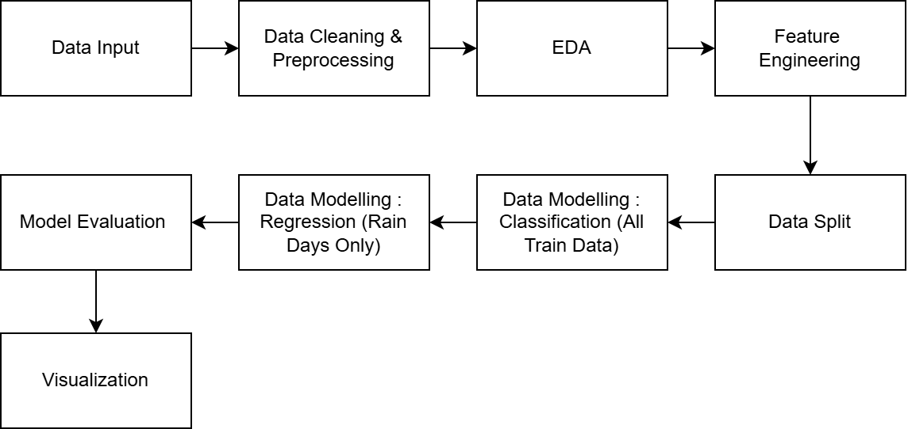
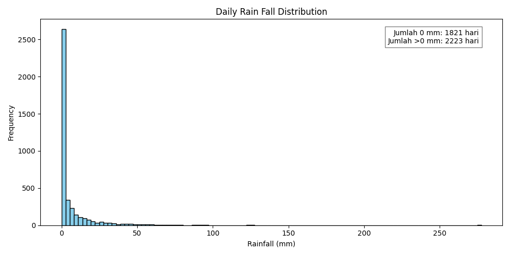
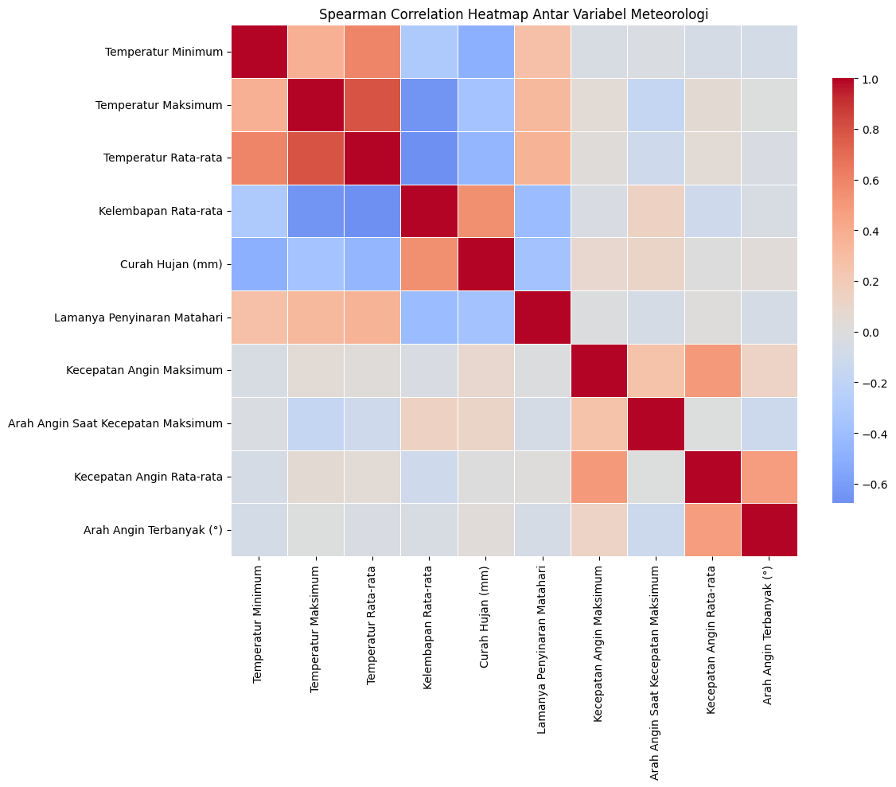
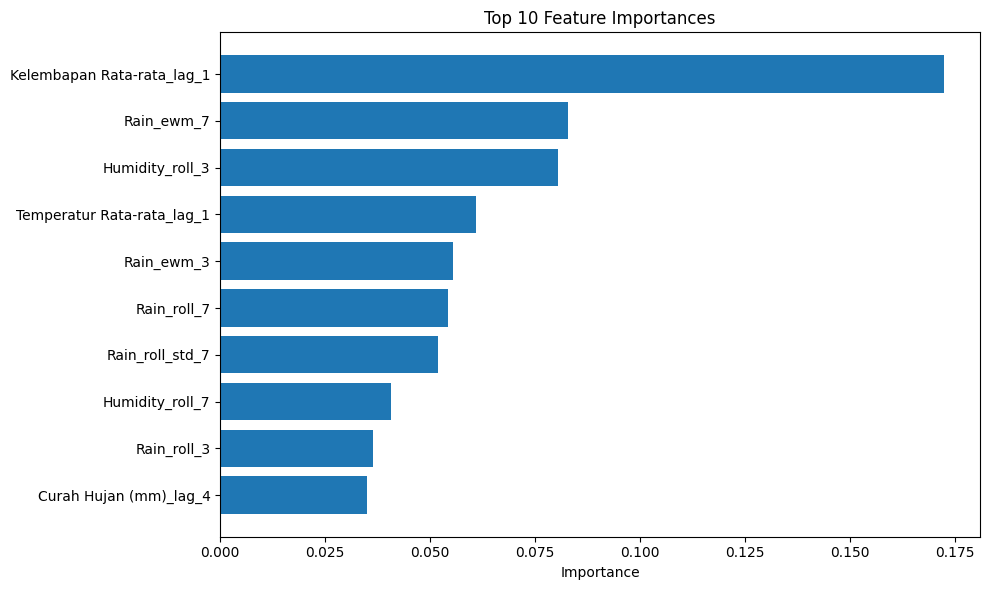

# Weather Prediction Using Two Stage Model (Random Forest Classifier + XGBRegressor) In DKI Jakarta 2025

Indonesia is a country with a tropical climate which has two main seasons, such as the dry season and the rainy season. Rainfall fluctuations, especially during the rainy season, are often difficult to predict. Therefore, this research aims to build a prediction model that can predict the occurrence of rain the next day (tomorrow) based on historical meteorological data obtained from the BMKG data bank.

---

## 📌 Quick Overview 
Predicting tropical rainfall in Indonesia is challenging due to the prevalence of non-rainy days (zero-inflated datasets) and the volatility of seasonal patterns driven by global warming. To address this, **this project implements a two-stage hybrid architecture that separately models the occurrence and intensity of rain, allowing the model to effectively capture patterns within rainy events without being skewed by the high frequency of zero-values.**

**Key Result:** 
- **MAE Reduction:** Improved from 10.82 mm to 7 mm.
- **Classification:** 71% Accuracy in predicting "Will it rain tomorrow?".
- **The Power of Feature Engineering** : The implementation of temporal features proved to have the most significant impact compared to using raw data alone. These features enable the model to capture moisture accumulation patterns, which serve as the primary drivers for rainfall in Jakarta.

---

## Table of Contents
1. [Dataset](#dataset)
2. [Flowchart](#flowchart)
3. [Data Understanding](#data-understanding)
4. [Data Preprocessing](#data-preprocessing)
5. [Feature Engineering](#feature-engineering)
6. [Model Development](#model-development)
7. [Results](#results)
8. [Conclusion](#conclusion)
9. [License](#license)
10. [Contact](#contact)

---

## Dataset 
The dataset used in this research is daily historical meteorological data sourced from the official online data portal of the Indonesian Meteorology, Climatology and Geophysics Agency (BMKG) with a location selection in Central Jakarta. 
- **Source**: dataonline.bmkg.go.id
- **Time Range**: Data is taken for the period 1 January 2015 to 31 December 2025.
- **Data Volume**: This dataset consists of 4043 rows of data (observations), where each row represents daily weather data.  

This dataset has 11 original attribute that record various weather parameters with the following description :

| Description | Unit |
| :--- | :--- |
| Waktu pencatatan data | - |
| Temperatur Minimum | °C |
| Temperatur Maksimum | °C |
| Temperatur Rata-rata | °C |
| Kelembapan Rata-rata | % |
| Curah Hujan | mm |
| Lamanya Penyinaran Matahari | Hour |
| Kecepatan Angin Maksimum | m/s |
| Arah Angin saat Kecepatan Maks. | ° |
| Kecepatan Angin Rata-rata | m/s |
| Arah Angin Terbanyak | ° |

[⬆ Back to Top](#table-of-contents)

---

## Flowchart

[⬆ Back to Top](#table-of-contents)

---

## Data Understanding

### Rainfall Distribution Analysis

This shows the dominance of 0 mm values, which account for 45% of the total data. Meanwhile, non-zero rainfall values have a distribution that is highly skewed to the right, with a long tail (heavy-tailed) representing moderate to extreme rainfall events. **This is why a two-stage modeling approach is justified**.

---

The visualization reveals extreme outliers that significantly exceed the rest of the dataset. **This highlights the high number of outliers, further supporting the fact that this dataset is dominated by zeros and exhibits heavy-tailed characteristics.**

---

### Correlation Analysis

The Spearman correlation heatmap shows that rainfall has **a weak to moderate relationship** with other variables, such as a positive correlation with humidity and a negative correlation with sunshine duration. **Since no single variable acts as a dominant predictor, this confirms that rainfall is driven by complex, non-linear interactions**. This result justifies the use of a two-stage hybrid model to capture these complexities more effectively than simple linear methods.

---

### Key Findings from Data Understanding
- Distribution: Rainfall data is zero-inflated (dominated by 0 mm) and heavy-tailed, indicating separate processes for rain occurrence and intensity.

- Correlation: Weak-to-moderate Spearman correlations suggest that raw daily data alone is insufficient, necessitating temporal-based feature engineering.

- Modeling Strategy: These findings justify a two-stage hybrid approach (Classification + Regression) to effectively handle zero-inflation and capture complex, non-linear patterns.

[⬆ Back to Top](#table-of-contents)

---

## Data Preprocessing 
- Combine Historical Data into 1 File
- Check Missing Values
- Data Mapping 
- Fill in missing values ​​using Random Forest 
- Perform Feature Engineering

[⬆ Back to Top](#table-of-contents)

---

## Feature Engineering
1. Sort Data by Date 

    Data is sorted chronologically based on the Date column to ensure the time series structure is maintained and prevent data leakage in the modeling process.

2. Lag Features
   These features were created to help the model learn from previous days conditions. The goal is to capture Temporal Dependencies and the Persistence Effect aknowledging that tomorrow's weather is heavily influenced by today's atmospheric state. The variables used for these lag features include:
 
    * Average Humidity
    * Average Temperature
    * Maximum Temperature
    * Minimum Temperature
    * Duration of sunlight

    with lags ranging from 1 to 4 days 

3. Rolling Mean (Moving Average)

   Rolling means were applied to variables highly correlated with rainfall, using window sizes of 3 and 7 days. These values were **then shifted by one day** to ensure only historical information is used, preventing any data leakage.

4. Exponentially Weighted Moving Average (EWMA)

    EWMA was created specifically for the Rainfall variable (mm) with periods of 3 and 7 days. This method gives greater weight to the most recent observations so it is more sensitive to changes in rainfall patterns than the usual rolling mean.

5. Rolling Standard Deviation

    Rolling standard deviation is used to measure the level of variation in rainfall within a certain time window (7 days).

6. Cylical Encoding 

    Cyclical encoding is applied to time information to capture seasonal patterns of rainfall. The Date column is reduced to a dayofyear feature, then represented using the sine and cosine functions. This approach is used so that the model understands that time is cyclical.

7. Extreme Rain Event Feature
    
    This feature was created to capture unusual rainfall conditions. The extreme rain threshold is determined using the 90th quantile of the rainfall distribution. This feature aims to help the model recognize the influence of previous extreme rain events on rain events the following day.

[⬆ Back to Top](#table-of-contents)

---

## Model Development

### Data Modelling

The modeling process follows a two-stage hybrid approach:
1. **Classification** to predict rain events (rain/no rain).
2. **Regression** to predict rainfall intensity, which is **only trained using data with rainy days**.

---

### Data Splitting 
The data is divided into 80% train and 20% test in a time-ordered manner (without shuffle) to maintain the temporal structure of the time series and prevent data leakage.

---

### Classification
The first stage aims to predict rain events as a binary classification problem, with labels 0 for no rain and 1 for rain. The model used is **Random Forest Classifier** with the parameter `class_weight="balanced"` to handle class imbalance. The model is trained using all training data (both rainy and non-rainy days). The model produces a probability of rain (0-1), which is then converted into a class prediction using a threshold of 0.5.

---

### Regression

The second stage predicts rainfall intensity with a different approach. **The regression model is ONLY trained using data from rainy days** (rain days only), using samples where actual rainfall is > 0 mm. The filtering process is carried out as follows:

1. Data filtering: From the entire dataset, only rows are taken where `Rain_mm_t+1 > 0` (based on ground truth/actual data)
2. Target transformation: Rainfall is transformed using `log1p` to reduce distribution skewness

The model used is **XGBoost Regressor**. By only training on rainy days, the model can focus on learning rain intensity patterns without being distracted by dominant zero values.
### Hybrid Prediction

In the prediction stage, the two models are combined sequentially:
- If the classifier predicts **no rain** (probability < 0.5) → final rainfall = 0 mm
- If the classifier predicts **rain** (probability ≥ 0.5) → the regressor is called to predict the intensity, and the final result = probability × predicted intensity

[⬆ Back to Top](#table-of-contents)

---

## Results

### Baseline vs Final Model 

| Task           | Baseline Model | Final Model |
|----------------|----------------|-------------|
| Classification | 66% Accuracy   | **72% Accuracy** |
| Regression     | 10.68 mm MAE| **7 mm MAE** |

---

### Impact of Temporal Feature Engineering

- **Classification**: Feature engineering improved accuracy from 66% to 72% with an ROC-AUC of 77%, enhancing the model's ability to distinguish rainy days.

- **Regression**: Modeling intensity saw a significant error reduction, with MAE dropping from 10.68 to 7 mm and RMSE from 20.98 to 16.58 mm.

- **Key Insight**: Temporal features like lag, rolling statistics, and EWMA provide crucial historical context that static daily data cannot capture.

---

### Major factors contributing to rainfall

- **Dominant Features**: Rainfall predictions are primarily influenced by temporal features, with average humidity (lag-1) and historical rainfall patterns (EWMA, rolling mean, and rolling std) showing the highest contribution.

- **Key Insights**: The results confirm that rainfall is influenced by the accumulation and persistence of atmospheric conditions over several days, rather than just instant weather changes.

---

### Model Limitations and Performance

Rainfall prediction remains challenging because **it relies heavily on daily surface-level meteorological data**, which limits the model’s ability to capture short-lived or highly rain events. The current dataset **lacks the spatial and temporal needed to fully represent these complexities. Therefore, further improvements would require higher-resolution sources, such as weather radar or satellite imagery, to better support the model's predictive power.

[⬆ Back to Top](#table-of-contents)

---

## Conclusion 

This project demonstrates that daily rainfall prediction in tropical regions is better approached using a two-stage model rather than a single regression model. By separating rainfall occurrence and intensity, and incorporating temporal feature engineering, the model is able to better capture historical weather patterns and reduce bias from zero-inflated data. While performance is constrained by the use of daily surface-level data, the proposed approach provides a more stable and interpretable framework for short-term rainfall prediction.

[⬆ Back to Top](#table-of-contents)

---

## License

This project is licensed under the MIT License.

---

## Contact

If you have any questions or feedback, feel free to reach out:
- **Email:** Ayusekar1822@gmail.com
- **LinkedIn:** https://www.linkedin.com/in/ayusekar22/
- **GitHub:** https://github.com/Ayusekar22

[⬆ Back to Top](#table-of-contents)